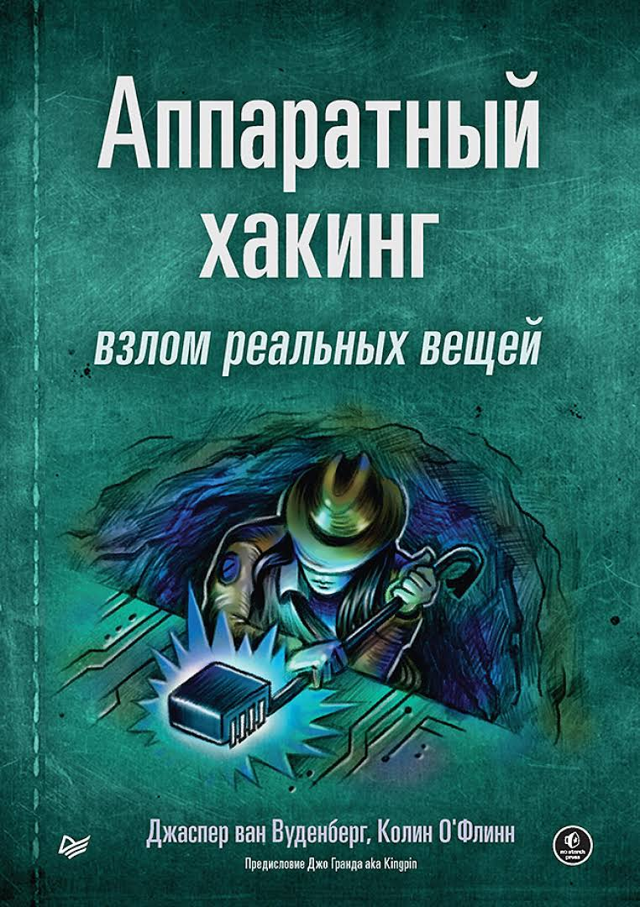

# Библиотека | Library
Тут можете найти архив книг по категориям. Книги будут помечены по языкам(ru/en). Полный список доступных книг будет постоянно расти и будет доступен в тгк
Некоторые книги попадают под несколько категорий, будут в той в которую наиболее подходят.

###  Категории: 
* Основы и Взлом (Hacking)
	* [Web](#web)

* [Реверс-инжиниринг и Pwn](#reverse) 
* [Hardware/IoT](#hardware)
* [Сети](#networks) 
* [Linux и Администрирование](#linux)
* Программирование
	* [База](#coding_basics)
	* [C/C++](#CPP)

*************
*************
*************
*************

 
## Web

## **Ловушка для багов. Полевое руководство по веб-хакингу**

* **Автор:** Питер Яворски
* **О чем:** Книга расчитана на начинающих. Эта книга - это
	практическое руководство по веб-хакингу и поиску уязвимостей (bug hunting), основанное на реальных отчетах исследователей безопасности.
* **Почему читать:** Книгу стоит прочитать ради практического освоения веб-хакинга и понимания логики взлома через реальные примеры и упражнения, подготовленные экспертами HackerOne.

[Скачать PDF](./files/Ловушка_для_багов.pdf) | [Google Drive](https://drive.google.com/file/d/1jspaH83EPpHacvL-74vtGe8B4_6c4v37/view?usp=sharing)

---

---
---
---
---

##  Риверс и Pwn

### **Хакинг: искусство эксплойта (2е издание)**
 

* **Автор:** Джон Эриксон
* **О чем:** Фундаментальная база по работе с памятью, переполнениями и сетевыми протоколами.
* **Почему читать:** Учит понимать как работают программы и как их можно взломать
* Язык: RU

[Скачать PDF](./files/hacking_art_of_exploitation.pdf) | [Google Drive](https://drive.google.com/file/d/14k-238VE0WU6zxGmWn-DvPP8Y50C19Y-/view?usp=drive_link) | [Оригинал](https://nostarch.com/hacking2.htm)

---

## Hardware/IoT

## **Аппаратный хакинг: взлом реальных вещей**

* **Автор:** Джаспер ван Вуденберг, Колин О'Флинн
* **О чем:** В этой книге вас обучат атаковать встроенные системы с практическими примерами.
* **Почему читать:** Эта книга - одна из лучших для тех кто хочет начать развиваться в сфере анализа встроенных систем и Iot.

[Скачать PDF](./files/Аппаратный_хакинг_взлом_реальных_вещей_Джаспер_ван_Вуденберг_Колин.pdf) | [Google Drive](https://drive.google.com/file/d/1q1Y8rfjTrusZyEpk6ql3lToY6jWQ4BvJ/view?usp=sharing)

----

----
----
----
---

## Сети (Networks)

### Компьютерные сети (5-е издание)

* **Автор:** Э. Таненбаум, Д. Уэзеролл
* **О чем:** фундаментальное пособие, описывающее принципы работы сетей от физического уровня до прикладных протоколов.
* **Почему читать:** Книга «Компьютерные сети» - это фундаментальный труд для любого, кто хочет понять, как функционирует цифровой мир.

[Скачать PDF](./files/Компьютерные_сети.pdf) | [Google Drive](https://drive.google.com/file/d/1vYnUMQbqPP18HwtkPlhkYwt8BUi1odx9/view?usp=sharing)

---