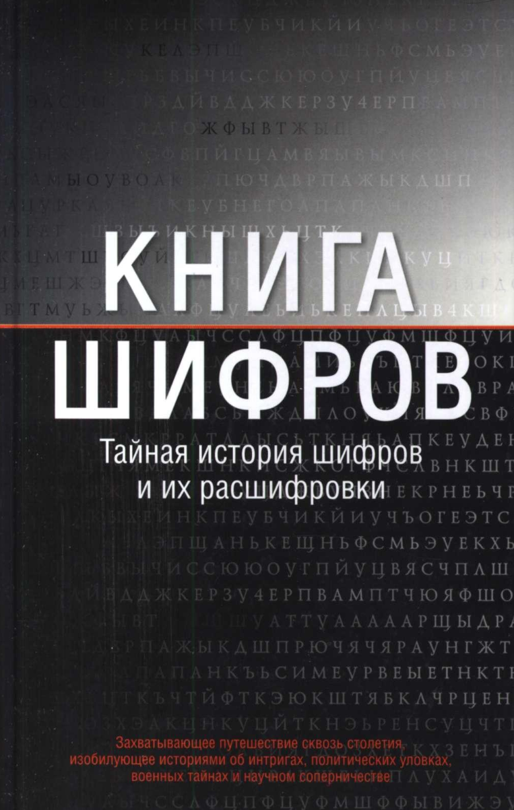

## **Прикладная криптография: Протоколы, алгоритмы и исходные тексты на языке C**
Автор: Брюс Шнайер
Язык: RU
[Скачать PDF](./files/Брюс_Шнайер_Прикладная_криптография.pdf) | [Google Drive](https://drive.google.com/file/d/1i1kFYJ7cfgKTEW6II8vMrD_Pd0_s-l2_/view?usp=sharing)

---

## **Книга шифров: Тайная история шифров и их расшифровки**

Автор: Саймон Сингх
Язык: RU
[Скачать PDF](./files/book_of_ciphers.pdf) | [Google Drive](https://drive.google.com/file/d/169APDNgWkgilLMwI27RdA2h4RoSaYVoB/view?usp=sharing)
