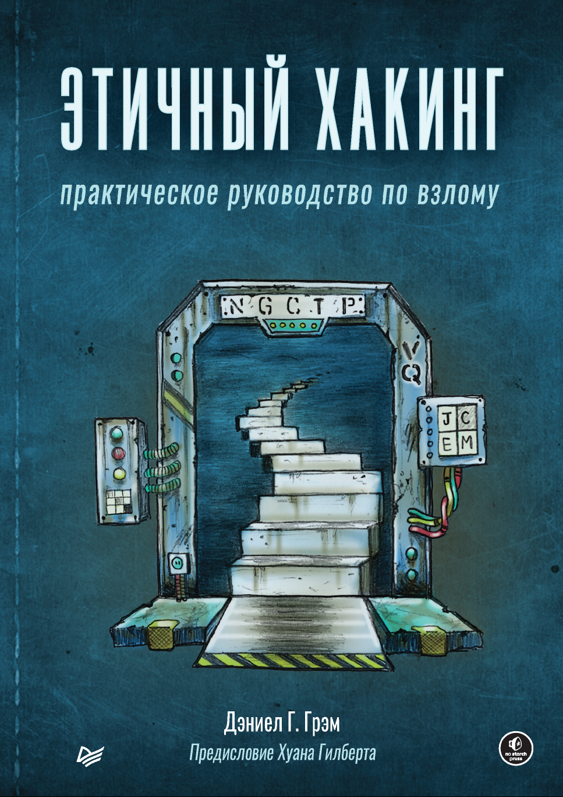
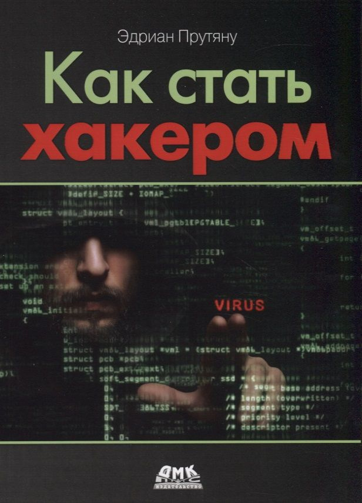

Тут книги по взлому

## **Этичный хакинг: практическое руководство по взлому**

Автор: Дэниел Г. Грэм
Язык: RU
[Скачать PDF](./files/Этичный_хакинг_Практическое_руководство_по_взлому_Дэниел_Г_Грэм.pdf) | [Google Drive](https://drive.google.com/file/d/1AUJpC2fGGc9wkWk9xtGA8LUE9-TTxnk3/view?usp=sharing)

---

## **Как стать хакером: Сборник практических сценариев, позволяющих понять, как рассуждает злоумышленник**

Автор: Эдриан Прутяну
Язык: RU
[Скачать PDF](./files/Как_стать_хакером_Сборник_практических_сценариев_позволяющих_понять.pdf) | [Google Drive](https://drive.google.com/file/d/1UhGAeAu_2mG23Pq0VVRMVixY2v0Kmn7U/view?usp=sharing)

---
