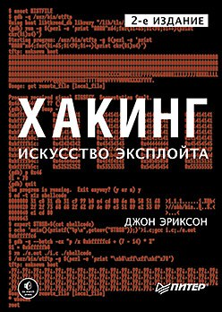
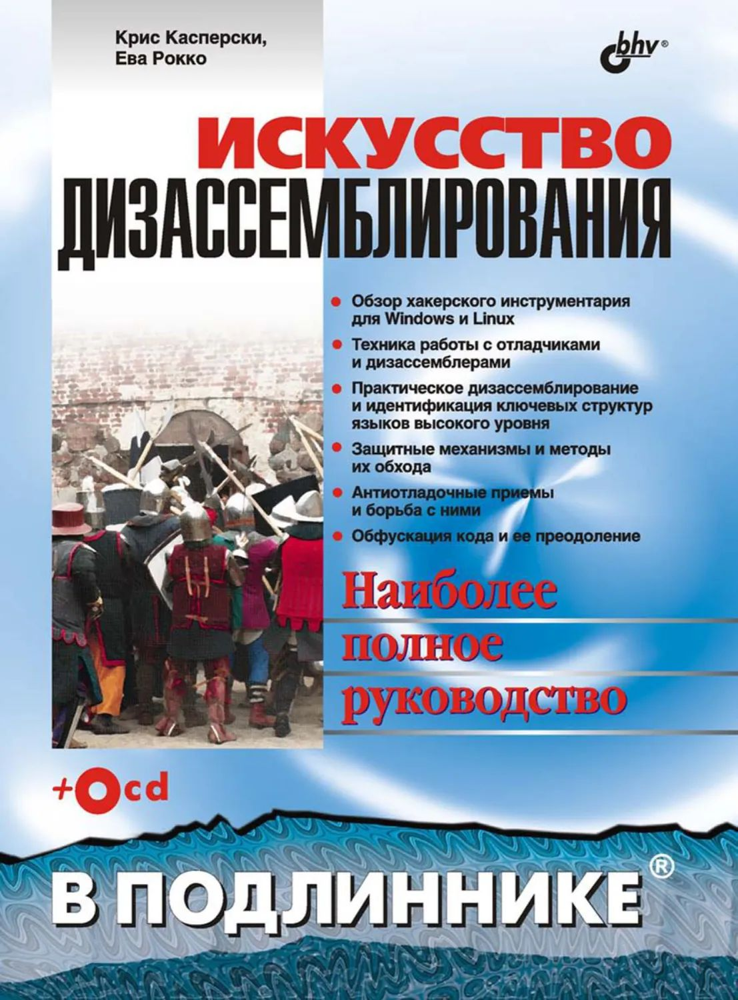

Тут книги по риверсу и pwn

### **Хакинг: искусство эксплойта (2е издание)**
 

* **Автор:** Джон Эриксон
* **О чем:** Фундаментальная база по работе с памятью, переполнениями и сетевыми протоколами.
* **Почему читать:** Учит понимать как работают программы и как их можно взломать
* Язык: RU

[Скачать PDF](./files/hacking_art_of_exploitation.pdf) | [Google Drive](https://drive.google.com/file/d/14k-238VE0WU6zxGmWn-DvPP8Y50C19Y-/view?usp=drive_link) | [Оригинал](https://nostarch.com/hacking2.htm)

---

## **Reverse Engineering для начинающих**
Автор: Денис Юричев
Язык: RU

[Скачать PDF](./files/Reverse_Engineering.pdf) | [Google Drive](https://drive.google.com/file/d/1Md80Kyk242K3GP6EJmzIrfaZ_GRntRzZ/view?usp=sharing)

---

## **Искусство дизассемблирования**

Автор: Крис Касперски
Яызк: RU

[Скачать PDF](./files/The_Art_of_Disassembly.pdf) | [Google Drive](https://drive.google.com/file/d/1urzcMRXXa2iYMWUlzpH_uefzSzfTPrJj/view?usp=sharing)

