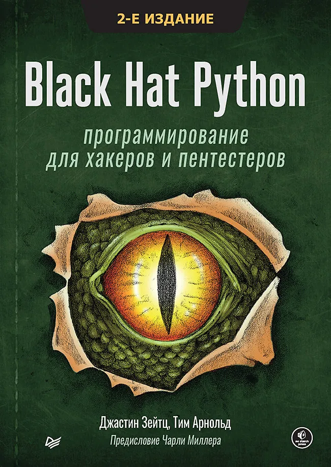

Книги по скриптингу в контексте иб

## Black Hat Python: программирование для хакеров и пентестеров

Автор: Джастин Зейтц, Тим Арнольд
Язык: RU

[Скачать PDF](./files/Black_Hat_Python_программирование_для_хакеров_и_пентестеров_Джастин.pdf) | [Google Drive](https://drive.google.com/file/d/1D_VszmlygUkS0DCSCyDvnJi-7JQGKM8C/view?usp=sharing)

---

<a name="blackhatgo1"</a>
## **Black Hat Go: Программирование для хакеров и пентестеров**

Автор: Стил Том, Паттен Крис, Коттманн Дэн
Язык: RU

[Скачать PDF](./files/Black_Hat_Go_Программирование_для_хакеров_и_пентестеров_Том_Стил.pdf)| [Google Drive](https://drive.google.com/file/d/12KgTEeT7-DdwF-LYkCnKc7p1g0j2FhqA/view?usp=sharing)
