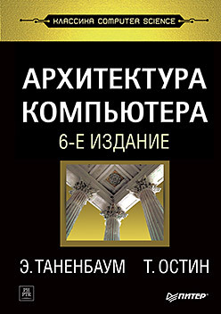

Тут книги с фундаметальными знаниями.

 
## **Архитектура Компьютера**

* **Автор:** Э. Таненбаум, Т. Остин
* **О чем:** Это фундаментальный учебник, в котором обьясняется структура ЭВМ, описывается как работают компоненты ПК на всех уровнях.

[Скачать PDF](./files/Архитектура_компьютера.pdf) | [Google Drive](https://drive.google.com/file/d/1JqL0Eal8iAdqC2JVJEy2YJp9dNcc2dQg/view?usp=sharing)

---
