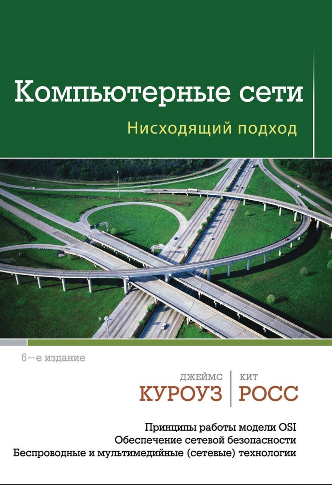

### Компьютерные сети. Нисходящий подход 

* **Автор:** Джеймс Куроуз, Кит Росс
[Скачать](https://drive.google.com/file/d/1G3LxK8b9NIcxPdrT-xoX26JX4ZnBwu6W/view?usp=sharing)

### Компьютерные сети (RU)

* **Автор:** Э. Таненбаум, Д. Уэзеролл
* **О чем:** фундаментальное пособие, описывающее принципы работы сетей от физического уровня до прикладных протоколов.
* **Почему читать:** Книга «Компьютерные сети» - это фундаментальный труд для любого, кто хочет понять, как функционирует цифровой мир.

[Скачать PDF](./files/Компьютерные_сети.pdf) | [Google Drive](https://drive.google.com/file/d/1vYnUMQbqPP18HwtkPlhkYwt8BUi1odx9/view?usp=sharing)

----
