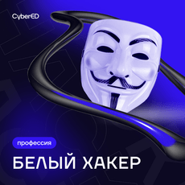

# Курсы (слитые и открытые)

**!! Файлы слитых курсов могут занимать много гб поэтому будут залиты в тгк !!**

## Категории
* [Слитые курсы/курсы в файлах](#withfiles)
* [Курсы на youtube](#youtube)
* [Курсы на других платформах](#other)

## Слитые курсы | Курсы в файлах
**Большинство материалов скачаны из открытых источников, будьте внимательны**

## **The XSS Rat — 26 курсов по инфобезу (2024) (EN)** 

* Этичный хакинг, пентест и Bug Bounty
* Подготовка к CompTIA Security+, CNWPP
* Взлом и защита: XSS, CSRF, XXE, IDOR, BAC
* API, WAF, Wireshark, Burp Suite, Jenkins
* Взлом мобилок, скриптинг, разведка, NIST
* Гайды, заметки, практические кейсы

[Скачать в ТГ](https://t.me/bocchithehack/9)

----

## **Wifi Pentesting | Взлом Wifi - Новый взгляд 2021**

* **Состав:** Видеолекции + доп. материалы.
* * **Описание:** Пошаговый гайд по взлому Wi-Fi: от теории до практических атак на Handshake и WPS.
* Более подробное описание в тг [Скачать Курс](https://t.me/bocchithehack/18)

---
----
---
---

## Youtube

 **Full-Length Hacking Courses (EN)**
 [Плейлист](https://youtube.com/playlist?list=PLLKT__MCUeixqHJ1TRqrHsEd6_EdEvo47&si=xDhXWHkby9zMFWNS) длинных видео от [The Cyber Mentor](https://youtube.com/@tcmsecurityacademy?si=GQC0UT-q81LlPb-a) с обучающими видео на разные темы - есть 15-часовой курс по этичному хакингу, несколько курсов по тесту веба, линуксу, ИИ, повышению привелегий, pwn и IoT.
 
**NetworkChuck (EN)**
Отличный [автор](https://youtube.com/@networkchuck?si=3Tf9ac7Olz2nSec8). Основной упор в его видео на сети (хорошо обьясняется). Есть [плейлист](https://youtube.com/playlist?list=PLIhvC56v63IKrRHh3gvZZBAGvsvOhwrRF&si=9asuANtoTSoTCyJP) по сабнетам. Также есть плейлисты по Иб.

**Ethical Hacking for Beginners**
[Канал](https://youtube.com/@ethicalhacking1?si=MvByvMISaNFa7Q1a) с переводами курсов с udemy. Курсы скорее вводные, подойдут чтобы расширить кругозор после курса со степика.

----
----
---
---

## Курсы на других платформах

## Stepik
	
  
 [«Профессия — Белый Хакер»](https://stepik.org/course/%D0%9F%D1%80%D0%BE%D1%84%D0%B5%D1%81%D1%81%D0%B8%D1%8F-%D0%91%D0%B5%D0%BB%D1%8B%D0%B9-%D0%A5%D0%B0%D0%BA%D0%B5%D1%80-169003/) Топовый курс для старта на русском языке. В курсе вы научитесь имитировать атаки на ИТ-инфраструктуру, искать уязвимости, узнаете об инструментах эксплуатации уязвимостей, научитесь анализировать трафик, повышать привелегии в различных информационных системах. Этот курс даст знания с которыми можно дальше уверенно развиваться в сфере этичного хакинга.
 

