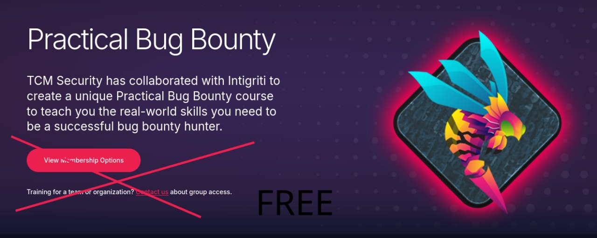

## Быстрая навигация 
* [Комплексные программы (сборники|несколько областей)](#Сборники)
* [Фундамент и Введение в ИБ](#основы)
* [Web](#web) 
* [Reverse Engineering & PWN](#reverse) 
* [Mobile](#mobile)
* [WiFi & Беспроводные сети](#wireless)

---

# Комплексные программы (Red Team / Pentest)

### **26 Курсов от XSS Rat**
---

* **Автор:** XSS Rat
* **Язык:** 🇬🇧 (English)
* **Описание:** Этичный хакинг, пентест и Bug Bounty; Подготовка к CompTIA Security+, CNWPP; Взлом и защита: XSS, CSRF, XXE, IDOR, BAC; API, WAF, Wireshark, Burp Suite, Jenkins; Взлом мобилок, скриптинг, разведка, NIST; Гайды, заметки, практические кейсы

[**Скачать в TG (40 GB)**](https://t.me/bocchithehack/9)

---
---

# WEB

### **TCM - Practical Bug Bounty**

* **Автор:** The Cyber Mentor 
* **Язык:** 🇬🇧 (English)
* **Описание:** На Google Drive можно смотреть без скачивания

[**Скачать (2.6 gb)**](https://drive.google.com/drive/folders/1_hvhBpWn229R_nKkW59onFieUSeH6RVo?usp=sharing)

---
----

# Reverse & pwn

---
---

# WiFi & Беспроводные сети

### **Wifi Pentesting | Взлом Wifi: Новый взгляд**

* **Язык:** RU
* **Описание:** Практический курс по аудиту безопасности беспроводных сетей. От настройки «боевого» окружения до эксплуатации сложных векторов.

[**Скачать в TG (2.5 gb)**](https://t.me/bocchithehack/18)

---

---
