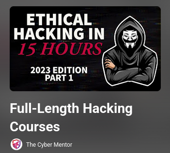
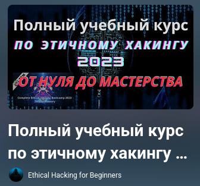

## Быстрая навигация 
* [Комплексные программы (сборники|несколько областей)](#Сборники)
* [Фундамент и Введение в ИБ](#основы)
* [Web](#web) 
* [Reverse Engineering & PWN](#reverse) 
* [Mobile](#mobile)

---

# Комплексные программы (Red Team / Pentest)

### **Full-Length Hacking Courses**

* **Автор:** LiveOverflow
* **Язык:** 🇬🇧 (English)
* **Формат:** Плейлист многочасовых видео (19)

[Смотреть плейлист](https://youtube.com/playlist?list=PLLKT__MCUeixqHJ1TRqrHsEd6_EdEvo47&si=RC7wYDvLaVmHRp0l) 

---

# Фундмент и Введение в ИБ

### **Полный учебный курс по этичному хакингу 2023 от нуля до мастерства**

* **Автор:** Ethical Hacking for Beginners
* **Язык:** RU
* **Описание:** Этот плейлист - перевод курса с переводом нейросети, лучше всего подходит для ознакомления, так как теор. база и глубина изучения тут не очень, но посмотреть  стоит. 

[Смотреть плейлист](https://youtube.com/playlist?list=PLrNhNTukZ_nF4GlvuniZJGC5cdfYDI0z7&si=9Vdde4QcS_Gqj7kJ) 

---
