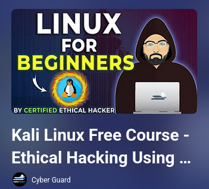
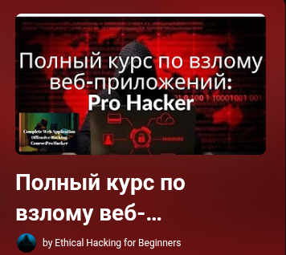
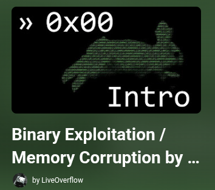
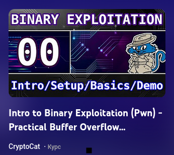

## Быстрая навигация 
* [Комплексные программы (сборники|несколько областей)](#Сборники)
* [Фундамент и Введение в ИБ](#основы)
* [Web](#web) 
* [Reverse Engineering & PWN](#reverse) 
* [Mobile](#mobile)

---

# Комплексные программы (Red Team / Pentest)

### **Full-Length Hacking Courses**

* **Автор:** LiveOverflow
* **Язык:** 🇬🇧 (English)
* **Формат:** Плейлист многочасовых видео (19)

[Смотреть плейлист](https://youtube.com/playlist?list=PLLKT__MCUeixqHJ1TRqrHsEd6_EdEvo47&si=RC7wYDvLaVmHRp0l) 

### Kali Linux Free Course - Ethical Hacking Using Kali Linux

* **Описание:** Хороший набор видео на разные темы, ориентирован на практику. !! Курс не на en, включите субтитры !!

[Смотреть плейлист](https://youtube.com/playlist?list=PLFOJ_XqzVbLMshj5eG3oFS6LP5K6I2wLE&si=1PSoTx39PKDYm-2p) 

---
---

# Фундмент и Введение в ИБ

### **Полный учебный курс по этичному хакингу 2023 от нуля до мастерства**

* **Автор:** Ethical Hacking for Beginners
* **Язык:** RU
* **Описание:** Этот плейлист - перевод курса с переводом нейросети, лучше всего подходит для ознакомления, так как теор. база и глубина изучения тут не очень, но посмотреть  стоит. 

[Смотреть плейлист](https://youtube.com/playlist?list=PLrNhNTukZ_nF4GlvuniZJGC5cdfYDI0z7&si=9Vdde4QcS_Gqj7kJ) 

---
---

# WEB

### **Полный курс по взлому веб-приложений: Pro Hacker**

* **Язык:** RU
* **Описание:** Как и другие плейлисты этого канала, это перевод курса с Udemy. Курс подходит для начала, для освоения основ. 

[Смотреть плейлист](https://youtube.com/playlist?list=PLrNhNTukZ_nEMnLjekejjT2mzxpd8OKdb&si=HZ7YhsPcXSrglhWn) 

---
---

# Reverse & pwn

### **Binary Exploitation / Memory Corruption by LiveOverflow**

* **Автор:** LiveOverflow
* **Язык**: EN
* **Описание:** 59 видео

[Смотреть плейлист](https://youtube.com/playlist?list=PLhixgUqwRTjxglIswKp9mpkfPNfHkzyeN&si=naxa0U1mpQY_2z2k) 

### **Intro to Binary Exploitation (Pwn) - Practical Buffer Overflow Challenges (for beginners)**

* **Автор:** CryptoCat
* **Язык:** EN
* **Описание (от автора)**: Learn the basics of Binary Exploitation (pwn) through a series of practical examples. We'll learn how to setup and use key tools including Ghidra/IDA, Radare2 (R2), GDB-PwnDbg/GEF/PEDA, PwnTools, Checksec, ropper, MSFVenom and more! We'll go on to develop exploits to overwrite stack variables, redirect execution to functions of our choice (ret2win), supply with function parameters, inject shellcode, return to lib-c (ret2system) etc. We'll also use format string vulnerabilities to overwrite global offset table (GOT) entries, leak PIE/libc, bypass canaries etc. We'll develop exploits manually and with PwnTools for both 32-bit (x86) and 64-bit using PwnDbg to debug. Write-ups/tutorials aimed at beginners - Hope you enjoy 🙂
* [**Файлы к курсу**](https://github.com/Crypto-Cat/CTF/tree/main/pwn/binary_exploitation_101) 

[Смотреть курс](https://youtube.com/playlist?list=PLHUKi1UlEgOIc07Rfk2Jgb5fZbxDPec94&si=LfT5EYCP30uVOKgZ)

---
---

